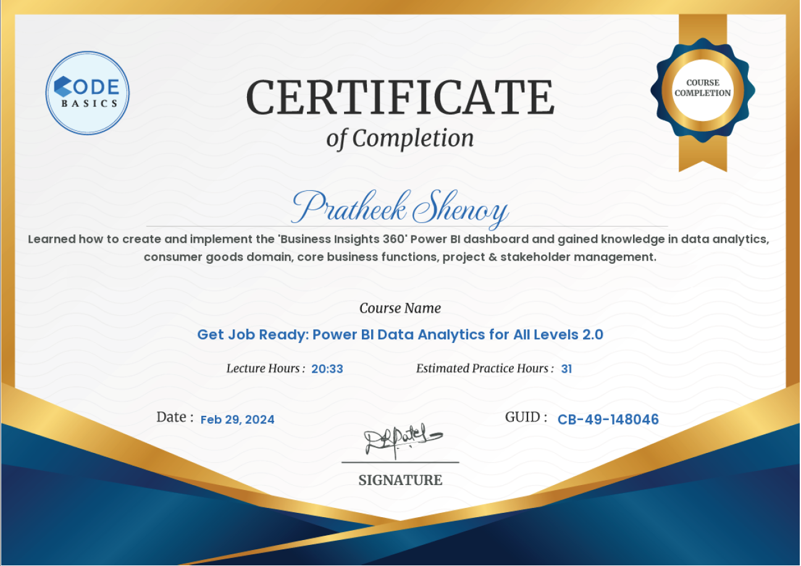

# Power BI Data Analytics Certificate

This repository contains my Power BI Data Analytics certificate, demonstrating proficiency in using Power BI for data analysis across all levels.

## Certificate Credential

- **Certificate Name:** Power BI Data Analytics for All Levels
- **Certificate Link:** [View Certificate](https://codebasics.io/certificate/CB-49-148046)

## Certificate Screenshot

## About the Certificate

The Power BI Data Analytics certificate demonstrates competence in using Power BI, a powerful business intelligence tool developed by Microsoft. With this certificate, I have proven my ability to create insightful visualizations, perform data analysis, and extract meaningful insights from various datasets using Power BI.

## About Power BI

Power BI is a widely-used business analytics tool that enables users to visualize and share insights from their data. It offers a range of features for data preparation, analysis, visualization, and collaboration, making it a valuable asset for businesses and professionals in various industries.

## About CodeBasics

CodeBasics is a platform that offers online courses and certifications in various domains, including data science, programming, and technology. Their Power BI Data Analytics course equips learners with the skills and knowledge needed to leverage Power BI for effective data analysis and visualization.

## Additional Information

For more information about Power BI and its capabilities, visit the [Power BI website](https://powerbi.microsoft.com/).

For details about CodeBasics courses and certifications, visit the [CodeBasics website](https://codebasics.io/).

